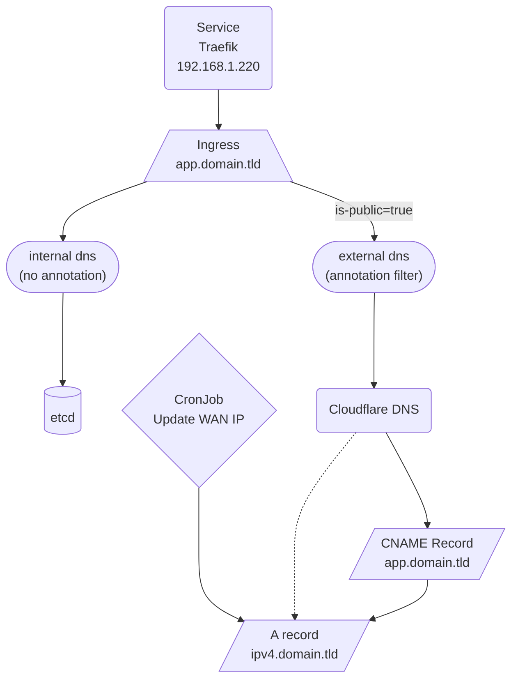

### My home operations repository :octocat:

_... managed with Flux, Renovate and GitHub Actions_ 🐱

 

---

## 📖 Overview

This is a mono repository for my home infraestructure and Kubernetes cluster. Infrastructure as Code and GitOps all the way.
Work in progress indefinitely.

---

## ☸ Kubernetes

I've used the [k8s-at-home/template-cluster-k3s](https://github.com/k8s-at-home/template-cluster-k3s) highly opionated template for deploying a k3s cluster with Ansible and Terraform backed by Flux and SOPS.

### :octocat: GitOps

In order to follow GitOps, all operations are made through Github.

```mermaid
flowchart LR
    a["👦\nme"]-->|edit|code-->|commit|g[Github]

    classDef git fill:#171515;
    class g git

```

On Github my cat (Pepinillo) is making sure [every dependency is up to date](https://github.com/MrMarble/home-ops/issues/5).

Fluxcd is then in charge of updating my cluster through automatic reconciliation.

```mermaid
flowchart RL
    c[Source Controller]-->|sync|a[Github]
    d[Kustomize Controler]--->c
    e["☸ Kubernetes API"]<-->c
    e<-->d
    f[Helm Controller]-->c
    f-->|Apply|b
    d-->|Apply|b
    subgraph b[Cluster]
    h[Namespaces]
    i["CRDs"]
    z[Helm Releases]
    end

    classDef default fill:#326ce5;
    classDef git fill:#171515;
    classDef cluster fill:none,stroke-dasharray:5 10,stroke:#fdfdfd;

    class a git
    class b cluster
```

### Directories

The Git repository contains the following directories under cluster and are orderer below by how Flux will apply them.
- **base**: Flux entrypoint
- **crsd**: Custom resource definitions (CRDs) that need to exist globally
- **core**: Important applications that should never be pruned by flux
- **apps**: Common applications grouped by namespaces. Flux will prune resources here if not tracked by Git anymore.

### Networking

| Name                         | CIDR                |
|------------------------------|---------------------|
| Kubernetes Nodes             | `192.168.1.0/24`    |
| Kubernetes external services | `192.168.1.220-230` |
| Kubernetes pods              | `10.42.18.0/24`     |
| Kubernetes services          | `10.43.0.0/16`      |

### Persistent Volume

I'm in the process of deploying my cluster, currently the only storage option is localy on each node.

---

## 🌐 DNS

---

## 🔧 Hardware

| Device                   | Count | OS Disk Size | Data Disk Size | RAM   | Operating System | Purpose           |
|--------------------------|-------|--------------|----------------|-------|------------------|-------------------|
| HP EliteDesk 800 G2 mini | 1     | 240GB NVMe   | 256GB SSD      | 8GB   | Ubuntu 20.04     | k3s Master/Worker |
| Raspberry Pi 3B          | 1     | 32GB SDCard  | N/A            | 4GB   | Raspbian         | Pi-hole           |
| Pi Zero 2 W              | 1     | 32GB SDCard  | N/A            | 512MB | Raspbian         | Pi-hole backup    |
| Raspberry Pi 3           | 1     | 32GB SDCard  | N/A            | 4GB   | Raspbian         | Octoprint         |
