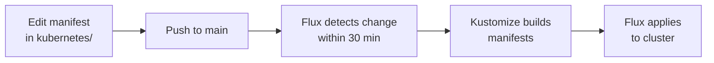
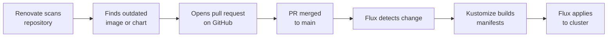

# GitOps

The cluster state is driven entirely from this repository. No manual `kubectl apply` — if it's not in Git, it doesn't exist in the cluster.

## Tools

### Flux

[Flux](https://fluxcd.io) runs inside the cluster and watches the `main` branch of this repository every 30 minutes. When it detects a change under `kubernetes/`, it reconciles the cluster to match the desired state. Flux also handles secrets decryption via SOPS/age before applying manifests.

### Kustomize

[Kustomize](https://kustomize.io) is used to compose and overlay manifests. Flux's Kustomization controller uses it to build the final manifests from the directory tree before applying them. Variable substitution (cluster settings, secrets) is injected at this stage via `postBuild`.

### Renovate

[Renovate](https://docs.renovatebot.com) runs as a GitHub App and scans the repository for outdated dependencies — container image tags, Helm chart versions, and more. When it finds an update it opens a pull request. Merging the PR is all that's needed to trigger a rollout.

## Repository Layout

```
kubernetes/
├── bootstrap/      # One-time cluster bootstrap resources
├── flux/           # Flux's own config and source definitions
│   ├── config/     # GitRepository + root Kustomization
│   ├── repositories/  # Helm, OCI, and Git source registries
│   └── vars/       # Cluster-wide settings and secrets
├── apps/           # Workloads, organised by namespace
├── components/     # Shared Kustomize components
└── templates/      # Reusable app templates
```

## Flows

### Making a manual change



### Automated dependency update via Renovate



::: callout tip "Pruning"
Flux runs with `prune: true`, meaning resources removed from Git are also deleted from the cluster automatically.
:::
