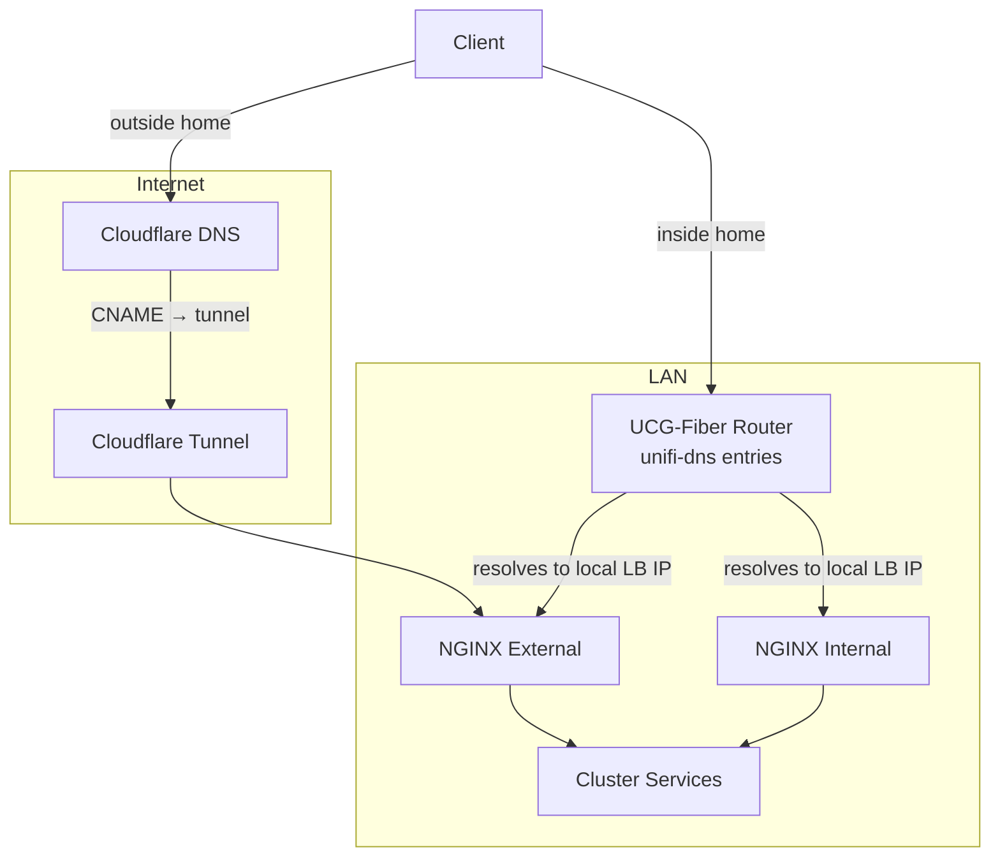

# Network

The network stack is designed so that every service is reachable at the same domain name regardless of whether you are on the home network or outside — without hairpinning through the internet when local.

## Components

### Cilium

[Cilium](https://github.com/cilium/cilium) is the cluster CNI. It handles pod-to-pod networking using eBPF and assigns `LoadBalancer` IPs to in-cluster services, removing the need for an external load balancer.

### kube-vip

[kube-vip](https://github.com/kube-vip/kube-vip) provides a virtual IP for the Kubernetes API server, keeping the control plane reachable through a single stable address even as master nodes come and go.

### NGINX (×2)

Two separate [ingress-nginx](https://github.com/kubernetes/ingress-nginx) instances handle inbound traffic:

| Instance | Exposure | Purpose |
|----------|----------|---------|
| External | Internet (via Cloudflare tunnel) | Routes publicly-exposed services |
| Internal | LAN only | Routes private services |

### Cloudflared

[Cloudflared](https://github.com/cloudflare/cloudflared) runs inside the cluster and maintains an outbound tunnel to Cloudflare. The external NGINX instance is the tunnel's backend, so no ports need to be opened on the router.

### external-dns

[external-dns](https://github.com/kubernetes-sigs/external-dns) watches Ingress objects and automatically creates the corresponding `CNAME` records in Cloudflare for any service annotated as public.

### unifi-dns

A small controller that watches Ingress objects and creates a DNS entry for each one directly in the UniFi router, pointing to the local `LoadBalancer` IP. This gives every service — public or private — a local DNS record, so LAN clients resolve to the internal IP without any query forwarding or split-horizon trickery.

---

## How it all fits together

### External access

When a request comes from outside the home network, Cloudflare resolves the domain to the tunnel endpoint. Traffic flows through the Cloudflare tunnel into the external NGINX instance, which routes it to the appropriate service.

### Internal access

When on the home network, the router already has a DNS entry for every ingress (created by unifi-dns), resolving directly to the local `LoadBalancer` IP. Traffic stays entirely on the LAN — the same domain name works without touching the internet.
